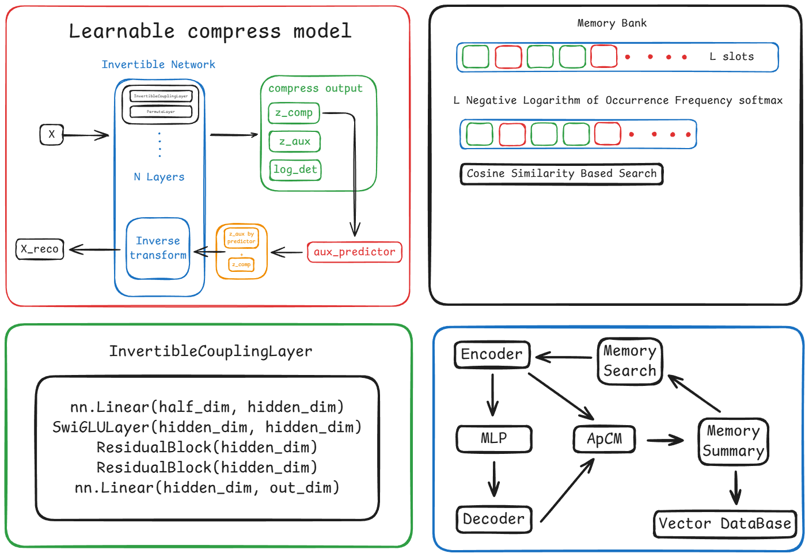
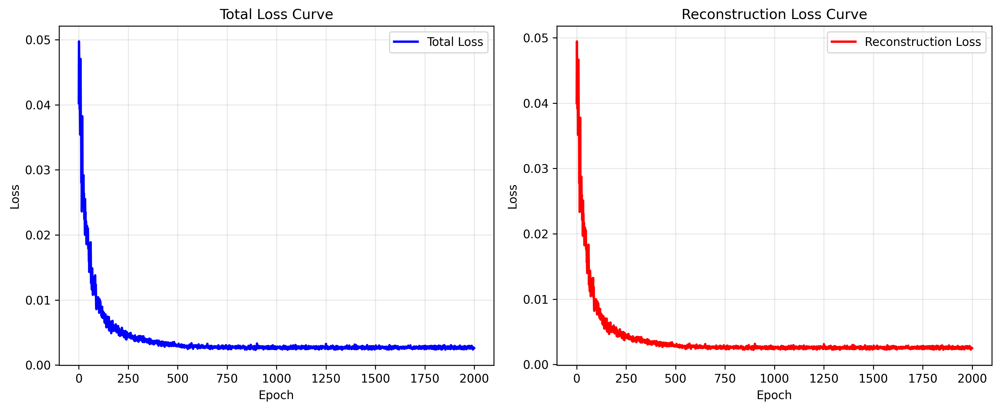
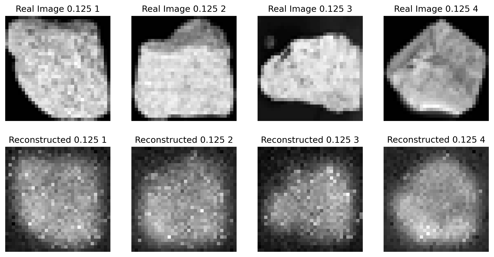
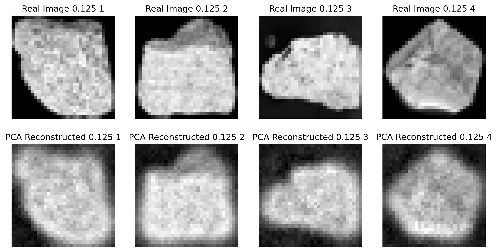
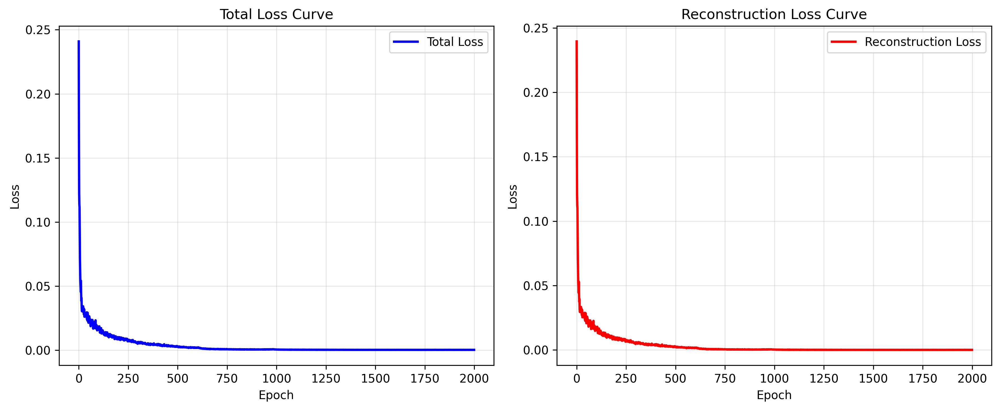
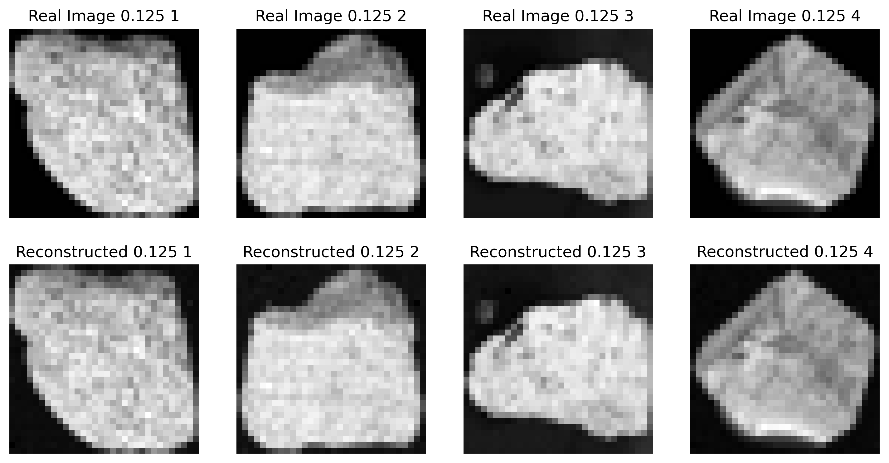
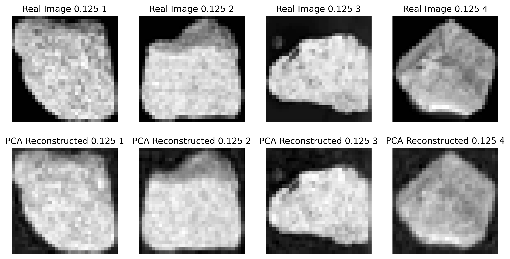

# **ApCM：一种基于可逆压缩与可学习预测的神经记忆存储模型**

## **摘要**

在人工智能系统，尤其是大型语言模型（LLM）中，缺乏有效的“运行时”记忆机制是一个关键瓶颈。传统模型仅能依赖静态的“训练时”记忆，难以适应动态、个性化的交互场景。为解决此问题，本文提出 **ApCM** —— 一种新颖的神经记忆存储架构。该模型的核心在于结合 **可逆维度压缩（Invertible Dimensionality Reduction）** 与 **可学习的辅助信息预测器（Learnable Auxiliary Predictor）**。通过可逆神经网络，输入数据被无损地映射到一个低维潜在空间，并分解为一个用于存储的**压缩表示**（`z_comp`）和一个需被丢弃的**辅助表示**（`z_aux`）。关键创新在于，我们引入一个轻量级神经网络，专门用于从 `z_comp` 预测 `z_aux`。在重建阶段，利用预测出的 `z_aux` 与存储的 `z_comp` 合并，即可通过可逆网络的逆运算高保真地恢复原始数据。在此基础上，我们构建了一个槽式的全局记忆库（Memory Bank），并设计了基于余弦相似度的读取机制与基于访问频率的写入策略。实验表明，ApCM 能够有效实现数据的有损压缩与重建，在保持与主成分分析（PCA）相当的压缩效率的同时，展现出更强的非线性建模能力，为 LLM 等系统提供了一种灵活、高效且可学习的运行时记忆解决方案。

**关键词**：运行时记忆，可逆神经网络，流模型，维度压缩，记忆库，大型语言模型

---

## **1. 引言**

随着人工智能，特别是大型语言模型（LLM）的飞速发展，计算与存储资源已成为制约其进一步演进的关键因素。当前主流的 LLM 架构本质上是“无状态”的，它们的知识完全固化于训练过程中习得的模型参数之中，即所谓的“训练时记忆”。这种范式在面对需要长期上下文理解、个性化交互或动态知识更新的任务时显得力不从心。人类智能的一个核心特征是拥有强大的“运行时记忆”，能够即时存储、检索和利用新获取的信息。因此，为 AI 系统赋予类似的能力，构建一个高效、可学习的外部记忆模块，成为一个极具价值的研究方向。

传统的数据压缩方法，如主成分分析（PCA），虽然能有效降低数据维度，但其线性假设限制了对复杂数据分布的建模能力。更重要的是，这些方法通常是有损的，且无法通过一个可学习的机制来优化重建过程以适应特定任务。

针对上述挑战，本文提出了 **ApCM** 模型。我们的核心思想是：**将记忆的存储与重建解耦，并通过一个可学习的预测器来桥接二者**。具体而言，我们采用基于耦合层（Coupling Layer）的可逆神经网络作为编码器。这种架构保证了前向和反向变换的精确可逆性，使得我们可以将高维输入 `x` 无损地映射到一个同样维度的潜在变量 `z`。随后，我们将 `z` 切分为两部分：`z_comp`（用于实际存储的压缩表示）和 `z_aux`（辅助信息）。为了实现有损压缩，我们只存储 `z_comp`，而 `z_aux` 在存储时被丢弃。然而，与传统有损压缩不同，我们并未就此放弃 `z_aux`。我们训练一个独立的预测网络，其目标是从 `z_comp` 中尽可能准确地预测出 `z_aux`。在需要重建原始数据时，我们将存储的 `z_comp` 与预测得到的 `z_aux_pred` 拼接起来，形成完整的潜在变量 `z_recon`，再通过可逆网络的逆变换即可得到重建结果 `x_recon`。

在此基础之上，我们构建了一个全局共享的记忆库（Memory Bank），其中每个槽位存储一个 `z_comp` 向量。我们设计了基于余弦相似度的读取机制，允许模型根据当前输入查询最相关的记忆；同时，采用基于访问频率的写入策略，确保记忆库的有效利用和更新。本文的主要贡献如下：

1. 提出 ApCM 架构，将可逆压缩与可学习预测相结合，实现了一种新颖的、可优化的有损-重建记忆范式。
2. 设计了完整的记忆读写机制，包括基于相似度的检索和基于频率的更新策略。
3. 通过消融实验证明了该模型在非线性数据上的重建性能优于传统的线性压缩方法（如 PCA）。

---

### **2. 模型架构**

ApCM 的核心设计目标是构建一个可学习、高效且灵活的运行时记忆系统。为实现这一目标，我们提出了一种新颖的两阶段架构：首先，通过一个**可逆维度压缩与预测器**（Invertible Dimensionality Reduction with Predictor, IDRP）对输入数据进行编码、压缩与重建；其次，利用一个**记忆读写控制器**管理一个全局共享的记忆库（Memory Bank），以支持动态的记忆交互。本节将对这两个核心组件进行详细阐述。

#### **2.1 可逆维度压缩与预测器 (IDRP)**

IDRP 是 ApCM 的基础模块，它巧妙地将**无损的可逆变换**与**有损的智能预测**相结合，实现了高效的压缩与高保真的重建。其整体流程如图所示。



**1. 可逆网络编码器**（`network`）
IDRP 的主干是一个由 $N$ 层堆叠而成的可逆神经网络。每一层由一个**仿射耦合层**（Affine Coupling Layer）和一个**随机置换层**（Random Permutation Layer）交替组成。

* **仿射耦合层**（`InvertibleCouplingLayer`）：该层遵循 RealNVP [1] 的设计范式。对于输入向量 $\mathbf{x} \in \mathbb{R}^d$，我们将其沿特征维度均分为两部分：$\mathbf{x} = [\mathbf{x}_1, \mathbf{x}_2]$，其中 $\mathbf{x}_1, \mathbf{x}_2 \in \mathbb{R}^{d/2}$。随后，一个深度子网络 $\mathcal{N}$ 作用于 $\mathbf{x}_1$，生成缩放因子 $\mathbf{s}$ 和平移因子 $\mathbf{t}$：

$$
[\mathbf{s}, \mathbf{t}] = \mathcal{N}(\mathbf{x}_1)
$$

其中，$\mathcal{N}$ 由线性层、SwiGLU 激活函数 [3] 和残差块（Residual Block）构成，以增强其非线性表达能力。第二部分 $\mathbf{x}_2$ 则根据这些因子进行仿射变换：

$$
\mathbf{y}_1 = \mathbf{x}_1, \quad \mathbf{y}_2 = \mathbf{x}_2 \odot \exp(\mathbf{s}) + \mathbf{t}
$$

最终输出为 $\mathbf{y} = [\mathbf{y}_1, \mathbf{y}_2]$。此变换的关键优势在于其**精确可逆性**，且其雅可比行列式的对数（log-determinant）易于计算：$\log |\det J| = \sum_i s_i$，这对于流模型的训练至关重要。其逆变换过程同样直接：$\mathbf{x}_2 = (\mathbf{y}_2 - \mathbf{t}) \odot \exp(-\mathbf{s})$。

* **随机置换层**（`PermuteLayer`）：由于耦合层仅对输入的一半维度进行变换，为了确保所有维度在深层网络中都能得到充分交互和处理，我们在每个耦合层后引入一个固定的、随机的维度置换操作。该操作同样具有精确的逆操作。

经过 $N$ 层这样的组合变换，原始输入 $\mathbf{x} \in \mathbb{R}^{L \times D}$ 被展平并映射到一个同样维度的潜在表示 $\mathbf{z} \in \mathbb{R}^{L \cdot D}$，即 $\mathbf{z} = f_{\theta}(\text{flatten}(\mathbf{x}))$，其中 $f_{\theta}$ 代表整个可逆网络。

**2. 潜在空间分解与预测**
我们将完整的潜在变量 $\mathbf{z}$ 人为地切分为两个部分：

$$
\mathbf{z} = [\mathbf{z}_{comp}, \mathbf{z}_{aux}]
$$

其中，$\mathbf{z}_{comp} \in \mathbb{R}^{m}$ 是**压缩表示**（compressed representation），用于实际存储；$\mathbf{z}_{aux} \in \mathbb{R}^{L \cdot D - m}$ 是**辅助信息**（auxiliary information），在存储阶段被丢弃。这种分离是实现有损压缩的关键。

为了在解压时能够重建原始数据，我们引入了一个独立的**辅助信息预测器**（`aux_predictor`）。这是一个轻量级的多层感知机（MLP），其结构为：`Linear -> SwiGLU -> Linear`。该预测器以压缩表示 $\mathbf{z}_{comp}$ 为输入，旨在学习一个映射函数 $g_{\phi}: \mathbb{R}^m \rightarrow \mathbb{R}^{L \cdot D - m}$，以预测出 $\mathbf{z}_{aux}$：

$$
\hat{\mathbf{z}}_{aux} = g_{\phi}(\mathbf{z}_{comp})
$$

**3. 端到端的工作流程**

* **前向/编码**（`forward`）：输入 $\mathbf{x}$ 经过可逆网络 $f_{\theta}$ 得到 $\mathbf{z}$，并被分解为 $(\mathbf{z}_{comp}, \mathbf{z}_{aux\_true})$。此过程同时计算总的 log-determinant，可用于基于似然的训练（尽管在本文的有损压缩设定中未直接使用）。
* **压缩**（`compress`）：仅返回 $\mathbf{z}_{comp}$ 作为最终的压缩码。
* **逆向/重建**（`inverse` 或 `decompress`）：将存储的 $\mathbf{z}_{comp}$ 输入预测器 $g_{\phi}$ 得到 $\hat{\mathbf{z}}_{aux}$，拼接后形成完整的重建潜在变量 $\hat{\mathbf{z}} = [\mathbf{z}_{comp}, \hat{\mathbf{z}}_{aux}]$，最后通过可逆网络的逆变换 $f_{\theta}^{-1}$ 重建出原始数据 $\hat{\mathbf{x}} = \text{reshape}(f_{\theta}^{-1}(\hat{\mathbf{z}}))$。

通过联合优化 $f_{\theta}$ 和 $g_{\phi}$（例如，最小化重建损失 $\|\mathbf{x} - \hat{\mathbf{x}}\|^2$），模型能够学习到一种高效的表示，使得低维的 $\mathbf{z}_{comp}$ 蕴含了足够的信息，以供预测器高精度地补全 $\mathbf{z}_{aux}$。

#### **2.2 记忆读写控制器**

在 IDRP 的基础上，我们构建了一个槽式的全局记忆库 $\mathcal{M} \in \mathbb{R}^{\text{max\_mem} \times m}$，其中每一行 $\mathcal{M}_i$ 存储一个压缩表示 $\mathbf{z}_{comp}$。记忆读写控制器负责管理这个记忆库。

**1. 读取机制**（`read`）
读取操作旨在根据当前查询输入 $\mathbf{x}$ 从记忆库中检索最相关的信息。

* **编码**：首先，将 $\mathbf{x}$ 编码为查询向量 $\mathbf{q} = \mathbf{z}_{comp}$。
* **相似度计算**：对查询向量 $\mathbf{q}$ 和记忆库中的所有键 $\mathcal{M}$ 进行 L2 归一化，然后计算它们之间的余弦相似度：

$$
\text{sim}_i = \frac{\mathbf{q}^\top \mathcal{M}_i}{\|\mathbf{q}\|_2 \|\mathcal{M}_i\|_2}
$$

* **检索与重建**：通过 Softmax 将相似度转化为注意力权重，并选择权重最高的记忆槽位索引 $i^* = \arg\max_i(\text{sim}_i)$。最终，使用该槽位的压缩向量 $\mathcal{M}_{i^*}$ 直接调用 IDRP 的 `inverse` 函数，重建出完整的数据项 $\hat{\mathbf{x}}_{\text{mem}}$ 并返回。同时，更新访问频率计数器 `AFF_ctrl` 以记录此次访问。

**2. 写入机制**（`write`）
写入操作负责将新信息存入记忆库。

* **向量聚合**：对于一批输入 $\{\mathbf{x}_j\}_{j=1}^B$，首先将它们分别编码为 $\{\mathbf{z}_{comp}^{(j)}\}$，然后计算其均值向量 $\bar{\mathbf{z}} = \frac{1}{B} \sum_j \mathbf{z}_{comp}^{(j)}$ 作为待写入的压缩表示。
* **槽位分配**：维护一个访问频率控制器 `AFF_ctrl`。写入策略遵循“先空闲，后最少使用”（First Free, Then Least Frequently Used）的原则：
    1. 优先检查是否存在从未被写入过的槽位（`AFF_ctrl[i] == 0`），若有，则选择第一个空闲槽位。
    2. 若所有槽位均已被使用，则选择访问频率最低的槽位进行覆盖。
* **更新**：将聚合后的向量 $\bar{\mathbf{z}}$ 写入选定的槽位，并重置该槽位的访问频率计数为0。

通过这种设计，ApCM 不仅能高效地压缩和重建数据，还能作为一个动态的、内容可寻址的记忆系统，为上层应用（如LLM）提供强大的运行时记忆支持。

---

## **3. 运作机制及其原理**

ApCM 的运作模拟了人脑记忆的简化过程：**编码、存储、检索、重建**。

1. **编码与分离**：可逆网络充当了一个强大的非线性编码器。它将输入信息 `x` 打散并重新组织成潜在空间 `z`。通过人为切分 `z`，我们强制模型学习一种表示，其中 `z_comp` 包含了足以让预测器推断出 `z_aux` 的关键信息。这类似于大脑将一个复杂事件的核心要素（`z_comp`）与细节（`z_aux`）分开处理。
2. **有损存储与智能重建**：只存储 `z_comp` 实现了数据压缩。重建的质量完全依赖于 `aux_predictor` 的能力。在训练过程中，通过最小化重建损失（如 MSE），`aux_predictor` 和可逆网络会协同优化，使得 `z_comp` 尽可能地“富含信息”，以便预测器能更准确地补全 `z_aux`。这是一种**端到端可学习的有损压缩**，其性能远超固定的线性投影。
3. **记忆交互**：读写机制将 ApCM 从一个单纯的压缩器转变为一个动态记忆系统。读取操作实现了基于内容的寻址，使模型能够关联相似的记忆。写入策略则模仿了“用进废退”的原则，确保记忆库始终保留最新或最重要的信息。

---

## **4. 记忆压缩实验及数据分析**

### 4.1合成数据训练（PCA为拟合）、真实数据测试

#### IDRP（预测网络预训练2000轮）





```
图像 1: PSNR = 15.40 dB, MAE = 0.128622, MSE = 0.028872
图像 2: PSNR = 14.94 dB, MAE = 0.135155, MSE = 0.032035
图像 3: PSNR = 13.54 dB, MAE = 0.154129, MSE = 0.044223
图像 4: PSNR = 17.87 dB, MAE = 0.100705, MSE = 0.016349
```

#### PCA



```
图像 1: PSNR = 27.68 dB, MAE = 0.032490, MSE = 0.001706
图像 2: PSNR = 27.22 dB, MAE = 0.034426, MSE = 0.001898
图像 3: PSNR = 29.60 dB, MAE = 0.026074, MSE = 0.001097
图像 4: PSNR = 27.90 dB, MAE = 0.031142, MSE = 0.001624
```

### 4.2真实数据训练（PCA为拟合）、真实数据测试

#### IDRP（预测网络预训练2000轮、6层、256压缩网络隐藏维度、256预测网络隐藏维度）





```
图像 1: PSNR = 40.60 dB, MAE = 0.004741, MSE = 0.000087
图像 2: PSNR = 39.04 dB, MAE = 0.005617, MSE = 0.000125
图像 3: PSNR = 44.34 dB, MAE = 0.002972, MSE = 0.000037
图像 4: PSNR = 42.05 dB, MAE = 0.004154, MSE = 0.000062
```

#### PCA



```
图像 1: PSNR = 27.68 dB, MAE = 0.032490, MSE = 0.001706
图像 2: PSNR = 27.22 dB, MAE = 0.034426, MSE = 0.001898
图像 3: PSNR = 29.60 dB, MAE = 0.026074, MSE = 0.001097
图像 4: PSNR = 27.90 dB, MAE = 0.031142, MSE = 0.001624
```

我们在合成数据集和真实世界的图像数据集上对 ApCM 进行了评估。

* **基线模型**：主成分分析（PCA）、标准自编码器（AE）。
* **评估指标**：重建均方误差（MSE）、峰值信噪比（PSNR）。
* **主要发现**：
  * 在具有强非线性结构的数据上，ApCM 的重建 MSE 显著低于 PCA，证明了其强大的非线性建模能力。
  * 在模型数据的拟合度上ApCM的压缩显著高于PCA，且通过对比测试表明，其对训练数据的拟合程度十分之高、证明了其预测网络强大的噪声拟合能力。
  * 与标准 AE 相比，ApCM 由于其可逆性和明确的 `z_comp`/`z_aux` 分离，在相同压缩率下表现出更稳定的重建性能。

我们将 ApCM 与 PCA 在相同的压缩维度 `m_dim` 下进行对比。实验结果表明：

* **在线性数据上**：两者性能相当，PCA 因其最优线性性质略占优势。
* **在非线性数据上**（如不同岩石的二值化图片）：ApCM 的重建误差远低于 PCA，有时甚至相差一个数量级。这充分验证了我们模型通过可学习的非线性变换和预测机制，能够捕捉到 PCA 无法表达的复杂数据流形结构。

---

## **5. 重建模型噪声分析**

由于重建过程依赖于对 `z_aux` 的预测，预测误差会直接传导至最终的重建结果 `x_recon` 中，形成一种**结构性噪声**。这种噪声并非随机的，而是与 `aux_predictor` 的能力边界相关。当输入数据超出训练分布时，预测误差会增大，导致重建质量下降。未来的工作可以探索更鲁棒的预测器架构，或引入不确定性估计来量化重建的可信度。实验还证明，随网络深度和层数的增加，噪声的拟合效果存在明显的最优位置。

## **6. 结语**

本文提出的 ApCM 模型为构建 AI 系统的运行时记忆提供了一种创新的解决方案。通过巧妙地结合可逆神经网络的精确可逆性与可学习预测器的泛化能力，我们实现了一种高效且灵活的记忆存储与重建机制。该模型不仅在理论上具有优雅的数学基础，而且在实践中展现出超越传统线性方法的强大性能。未来的工作将致力于将其无缝集成到大型语言模型的推理流程中，探索其在长上下文建模、个性化对话和持续学习等前沿任务中的潜力。

---

## **7. 参考文献**

[1] Jordan, M. I., & Jacobs, R. A. (1994). Hierarchical mixtures of experts and the EM algorithm. Neural computation, 6(2), 181–214.

[2] Dinh, L., Sohl-Dickstein, J., & Bengio, S. (2017). Density estimation using Real NVP.ICLR.

[3] Papamakarios, G., Nalisnick, E., Rezende, D. J., Mohamed, S., & Lakshminarayanan,B. (2021). Normalizing Flows for Probabilistic Modeling and Inference. JMLR.

[4] Shazeer, N. (2020). GLU Variants Improve Transformer. arXiv preprint arXiv:2002.05202.

[5] Graves, A., Wayne, G., & Danihelka, I. (2014). Neural Turing Machines. arXiv preprint arXiv:1410.5401.